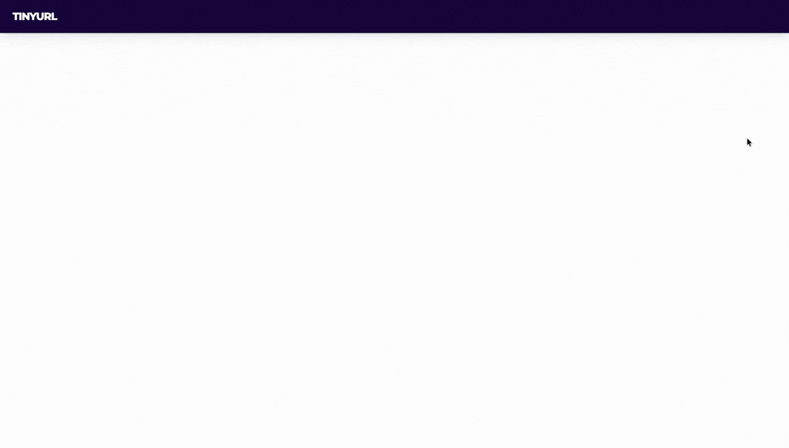

# TinyURL — Production-Grade URL Shortener

A single-region, production-oriented URL shortener built with Spring Boot and Angular, deployed on AWS.

- **Frontend:** [tinyurl.buffden.com](https://tinyurl.buffden.com) — Angular SPA on S3 + CloudFront
- **Backend / Short links:** [go.buffden.com](https://go.buffden.com) — Spring Boot on EC2 behind ALB



---

## Architecture

### v1 — Baseline (Implemented)

- Base62 encoded short codes (6–8 chars)
- DB-backed ID generation via PostgreSQL sequence
- Stateless Spring Boot application server
- HTTP 301 (permanent) or 302 (expiring) redirects
- Optional expiration (default 180 days)
- Flyway-managed schema migrations
- Prometheus metrics + structured JSON logging

[](diagrams/docs/architecture/00-baseline/v1/url-shortener-v1-hld.svg)

### v2 — Scale & Abuse Resistance (Planned)

- Redis cache (cache-aside pattern)
- Negative caching for invalid codes
- Rate limiting (token bucket)
- Soft delete support
- Custom aliases (feature-flagged)

[](diagrams/docs/architecture/00-baseline/v2/url-shortener-v2-hld.svg)

---

## Stack

| Layer | Technology |
| --- | --- |
| Backend | Spring Boot 3.5, Java 21, Gradle |
| Frontend | Angular 19, Angular Material, SSR |
| Database | PostgreSQL 16 |
| Migrations | Flyway |
| Reverse proxy | Nginx |
| Containerization | Docker, Docker Compose |
| Cloud | AWS (EC2, RDS, ALB, S3, CloudFront) |
| CI/CD | GitHub Actions → GHCR → EC2 via SSM |
| Observability | Micrometer, Prometheus, CloudWatch |

---

## API

| Method | Path | Description |
| --- | --- | --- |
| `POST` | `/api/urls` | Shorten a URL |
| `GET` | `/{shortCode}` | Redirect to original URL |

---

## Running Locally

### Prerequisites

- Docker & Docker Compose
- Java 21 (for running backend without Docker)

### Full stack (backend + database + nginx)

```bash
docker compose up --build
```

App available at `http://localhost:8080`.

### Backend only

```bash
cd tinyurl
./gradlew bootRun
```

### Run tests

```bash
cd tinyurl
./gradlew test
```

> Tests use Testcontainers — Docker must be running.

---

## Project Structure

```text
tinyurl/                # Spring Boot backend
tinyurl-gui/            # Angular frontend
infra/
  nginx/                # Nginx configs (dev + prod)
  postgres/             # DB init scripts
docs/
  architecture/         # ADRs and architecture docs
  deployment/           # AWS deployment runbook (phases A–F)
diagrams/               # Architecture diagrams (SVG)
docker-compose.yml      # Local dev stack
```

---

## Deployment

Production is deployed on AWS. See [`docs/deployment/`](docs/deployment/README.md) for the full runbook.
