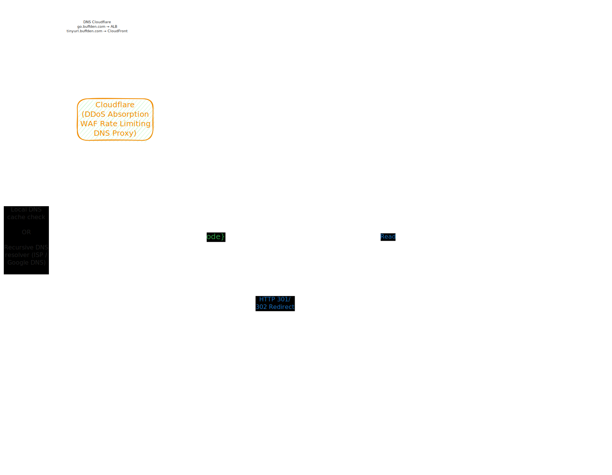
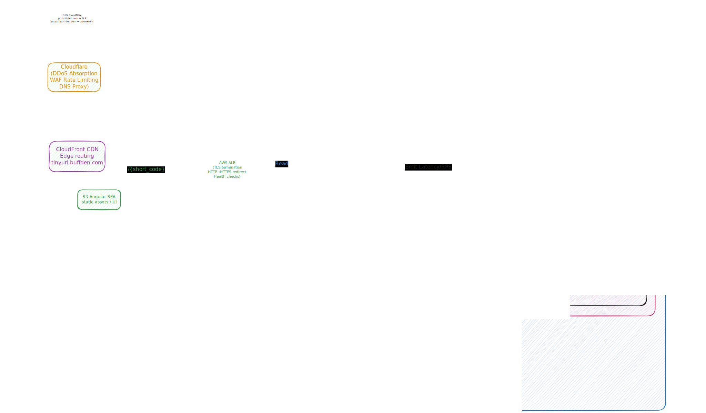

# System Design

> High-level architecture overview for TinyURL across versions.

---

## 1) System Overview

TinyURL is a single-region URL shortener deployed in `us-east-1`. The API and short URL redirects are served at `go.buffden.com`; the Angular SPA is hosted at `tinyurl.buffden.com` (S3 + CloudFront). The system accepts long URLs, generates unique short codes, and redirects users to the original URL with low latency.

The architecture is CloudFront-first at the edge, with backend services running as Docker containers orchestrated by Docker Compose on a single EC2 host. The application tier is stateless and backed by a relational database, with caching introduced in v2 to absorb redirect traffic.

---

## 2) Component Architecture

### v1 Components

| Component | Responsibility |
| --- | --- |
| DNS (Route 53) | Resolves `go.buffden.com` → ALB (API/redirects); `tinyurl.buffden.com` → CloudFront (Angular SPA). |
| AWS ALB | TLS termination, HTTP→HTTPS redirect, health checks, routes traffic to EC2 instances. |
| CloudFront (SPA dist) | Serves Angular SPA from S3 origin with CDN caching and SPA fallback rules. |
| Nginx | Reverse proxy inside EC2 Docker Compose. Routes requests to the Spring Boot app. |
| Application Server | Stateless — any instance can handle any request. Horizontally scalable within the backend runtime boundary. |
| PostgreSQL | Primary data store. Stores `short_code → original_url` mappings. Single primary. |

### v2 Additions

| Component | Responsibility |
| --- | --- |
| Nginx (v2) | TLS termination, reverse proxy, static rate limiting. |
| Redis | Cache-aside for redirect path. Negative caching for unknown codes. |
| Metrics | RPS, latency percentiles, cache hit ratio, DB latency. |
| Structured Logs | Request tracing and operational debugging. |

## 2.1 Deployment Model and Docker Compose Role

- **Local development**: Docker Compose is the default runtime for backend app + PostgreSQL (+ Redis in v2).
- **Single-host production runtime**: Docker Compose orchestrates backend containers on EC2 (Nginx, app, PgBouncer, PostgreSQL, Redis v2, observability sidecars if enabled).
- **Frontend boundary**: Angular frontend hosting is outside Compose (CloudFront + S3), per ADR decisions.
- **Out of scope for Compose**: multi-node orchestration, autoscaling control planes, and cloud infrastructure provisioning.

---

## 3) Data Flow

### Write Path (Create Short URL)

1. Client sends `POST /api/urls` with original URL and optional expiry.
2. Request passes through Route53 → ALB → Nginx → App.
3. App validates input (URL format, length).
4. App generates `short_code` via DB sequence + Base62 encoding.
5. App writes mapping to PostgreSQL.
6. (v2) App warms Redis cache for the new mapping.
7. App returns the short URL to the client.

### Read Path (Redirect)

1. Client accesses `GET /<short_code>` at `go.buffden.com`.
2. Request passes through Route53 → ALB → Nginx → App.
3. (v2) App checks Redis cache first.
4. On cache miss: App queries PostgreSQL by `short_code`.
5. App checks expiry and deletion status.
6. If valid: redirect with HTTP 301 or 302 (based on expiry policy).
7. If expired/deleted/not found: return HTTP 404 or 410.
8. (v2) App populates Redis cache on miss (cache-aside pattern).

---

## 4) Failure Domains

| Component | Failure Impact | Mitigation |
| --- | --- | --- |
| PostgreSQL down | All redirects and creates fail | Automated backups, failover plan, 503 response |
| Redis down (v2) | Cache misses → all traffic hits DB | Circuit breaker, degrade to DB-only mode |
| App crash | Partial 5xx errors | Multiple instances, health checks, auto-restart |
| Nginx/TLS cert expired | Full HTTPS outage | Automated cert renewal (Let's Encrypt), monitoring |
| DNS resolution failure | Full outage | Correct records, sensible TTL, resolver caching |
| CloudFront behavior misconfiguration | Partial/full routing outage | Versioned config rollout, staged validation, and rollback |

---

## 5) Scaling Strategy

### v1
- **App tier**: Horizontal scaling within the Docker Compose backend runtime boundary (single-host baseline).
- **DB tier**: Single primary, vertically scaled. Adequate for 1K avg QPS.
- **No caching**: At 5K QPS peak, a properly indexed PostgreSQL instance (in-memory index + connection pooling) can sustain redirect lookups without requiring a cache tier.

### v2
- **App tier**: Autoscaling based on CPU + P95 latency.
- **Cache tier**: Redis cluster mode for HA and shardable capacity.
- **DB tier**: Single primary with connection pool tuning. Read replicas considered only under measured cache miss pressure.
